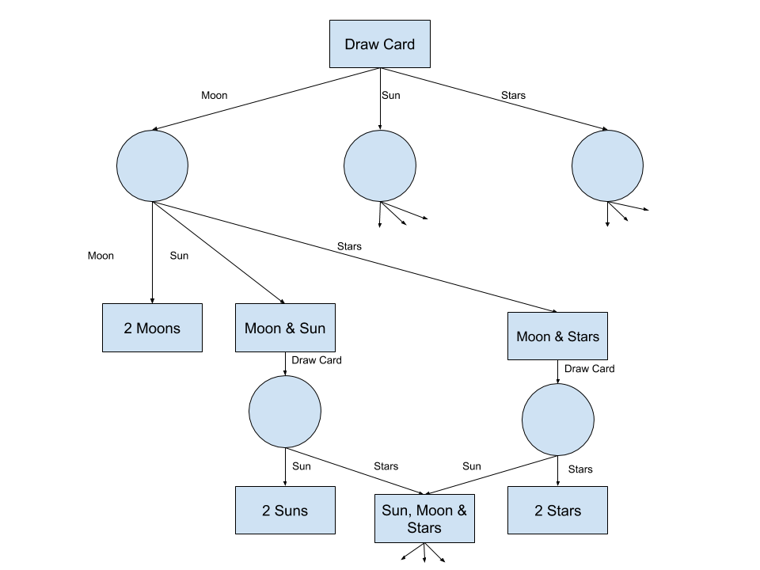

Assignment 2
============

## 1. Problem State vs. Search State
Problem state refers to the state of the problem as a whole, where as the search state is the state associated with a particular node in the search tree. Using the example of traveling through Turkey, which we discussed in class, we can define the problem state as the search for a path from our origin city to Bucharest, whereas our search state is the state for each node in our graph, which represents the cities that were traveled to in order to get to that point and the cost associated with that journey.

## 2. Text Problem 4.1
a) Local beam search with k = 1 is hill-climbing search.

b) Local beam search with one initial state and no limit on state retention is  similar to a breadth-first search in that it completes one complete layer, before moving on.

c) If we ignore that the annealing would terminate immediately, the algorithm would be similar to a first-choice hill climbing algorithm, as each downward successor would be rejected (probability 1).

d) Because T is infinite, the algorithm is always willing to accept a new state, and therefor is a random-walk search.

e) Because N is 1, the two parents will be the same individual, resulting in a low likelihood for mutations. Therefor the algorithm executes a random walk in the space of individuals.

## 3. Fitness Function
Since we want the overall population to grow, we can define the fitness function as the total population size, defined as `f = Nm + Nf`. State would be represented using the following format:

`(Nm, Nf, Ndp, Nep)` or `NmNfNdpNep`

Where:
- `Nm` is the number of Males
- `Nf` is the number of Females
- `Ndp` is the amount of food units per day per individual (calculated via `Nd / (Nm + Nf)`)
- `Nep` is the number of enrichment items per individual (calculated via `Ne / (Nm + Nf)`)

In order to introduce genetic variety, we would have the males and females crossover between enclosures via a uniform crossover function. In a uniform crossover there is a fixed mixing ratio between parents, which allows for parent chromosomes to contribute the gene level rather than the segment level, as is the case with single- and two-point crossover (which was what was discussed in class with the n-queens problem). In order to implement the uniform crossover, parents are switched with a fixed probability of 0.5, and results in a distribution similar to the diagram shown below.

## 4. And-Or Search Tree

### Pair Programming Equitable Participation & Honesty Affidavit
We the undersigned promise that we have in good faith attempted to follow the principles of pair programming. Although we were free to discuss ideas with others, the implementation is our own. We have shared a common workspace and taken turns at the keyboard for the majority of the work that we are submitting. Furthermore, any non programming portions of the assignment were done independently. We recognize that should this not be the case, we will be subject to penalties as outlined in the course syllabus.

 
 
---
Pair Programmer 1 (print & sign your name, then date it)

 
 
---
Pair Programmer 2 (print & sign your name, then date it)
